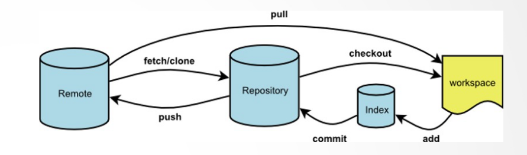

# 基础
## 文件的增删改查
### 查
cd  改变目录
pwd 显示当前文件的绝对路径
ls  查看当前目录内容    ls默认不显示以.开头的文件
- ls 路径
- cat 路径  连接文件=>查看文件内容
- head 路径 同上，只展示前10行
    head 路径 -n 14     可以改变参数来控制展示行数
- tail 路径 同上，展示后十行
- less 路径 可以滚动显示，j向上k向下，方向键也可以
q   退出
选中会复制，复制会高亮，按esc可以退出高亮

### 增
创建文件
    touch 文件名    如果不存在会创建
    echo xxx    会返回xxx
        echo xxx > 1.txt    会将内容覆盖进1.txt文件 一个>表示覆盖
        echo haha >> 1.txt  两个大于号表示追加
        echo -e "sss\nhhh"  在双引号中的\n可以表示回车
        直接打回车可以
创建文件夹
    mkdir   创建文件夹
    mkdir -p a/b/c/d/e  创建深层文件夹
同时创建多个文件
    touch   1.txt   2.txt
同时创建多个文件夹
    mkdir   1   2
    mkdir   1/a/b   1/d/e   会自动合并的
复制文件
    cp 1.txt 2.txt  将1.txt的内容复制到2.txt
复制文件夹
    cp -r a b

### 删除
删除文件
    rm 1.txt
删除文件夹或目录
    rm -r a
    rm -rf a    表示关闭在删除文件夹时可能会出现的询问

用户目录缩写    ~

### 修改
1. 用echo向文件中追加
2. 使用vscode修改
    code 1.txt，会使用vscode打开
3. 先将文件设定默认打开方式为vscode
    start 1.txt就可以
    open 1.txt是mac系统

### 清空
1. echo '' > 1.txt
2. 全选删除保存。。。

### 重命名
mv 1.txt 2.txt
### 移动
mv 1.txt a
mv a/1.txt ./Desktop

### 修改文件更新时间
ls -l   可以看到文件更新时间    简写ll
touch 文件可以更改文件的更新时间
    存在就更新时间
    不存在就新建

## 其他操作以及脚本文件
### 手册
ls --help
以管道的形式放在less里查看
ls --help | less

### tldr
太长不想看
too long;didn't read
tldr
yarn global add tldr
或
npm i -g tldr

安装了tldr，使用tldr ls，可以看到ls的常见的使用方法

### 命令成功与失败
&&命令，第一条成功之后才会执行下一条
;命令，不管成功还是失败都会执行另一条

### 多个步骤合在一起    脚本文件
- 创建脚本文件，后缀有没有无所谓
    touch 文件名    即可

alt+. 将上一次的最后一个参数复制下来
脚本文件中的命令：回车代替了分号

chmod +x 文件   附加可执行权限，在Windows上没有这个概念

./文件就可以执行这个文件的内容，但是只能执行一次，因为文件已经被创建过了
这时可以
1. 删除文件，重新zhixing
2. 给文件添加参数
    x -> $1，一定记得执行文件时有参数
    使用时：./文件名 想创建的文件名


./文件名  执行文件
sh 文件名   也可以执行文件
    如果加了shebang，删掉sh也可以，只是出现在mac或Linux系统，shebang就是一行注释，注明用什么语言来运行当前的脚本
```但是一定要写./或者绝对路径```

不想写./、sh，只需要将该文件目录加到path中，只需要文件名就可以执行


```命令行的本质就是可执行文件，.exe只是给人看的，没有他也已经在path中了```
windows优先找次序高的一级且带有.exe后缀的，windows有缓存的。。。

今天学的是bash，也叫bash脚本文件，bash script 语法


## 问题
code命令无法在git bash中运行，显示错误
    /d/Microsoft VS Code/bin/code: line 61: /d/Microsoft VS Code/Code.exe: Permission denied
解决方法：
1. 查看code是否添加进path中
2. 添加了依然无法运行
3. 在D:\Microsoft VS Code文件夹中，查看Code.exe的属性->兼容性，取消“以管理员身份运行”
4. 运行code显示错误，代码的第二个实例已以管理员身份运行
5. 重新启动vs code，再次运行code命令，可以执行


# git本地仓库
## 基础命令
在git bash中运行git，整个框是bash

git 版本控制

### git init    初始化，创建一个仓库
git init    会创建.git目录
<!-- vi 命令，不要学，会头疼。。。 -->
code .  表示在VS code中打开当前目录
ls -a   表示打开所有目录，包括以.开头的文件
.git文件夹用于容纳代码快照

### git add 哪些可以提交，还没提交，标记要
- git add 路径，可以为绝对路径、相对路径  .和*
- 添加之后，vscode中会显示A，表示可以提交，U表示未添加
- ```git add 可以删除```
- 删除提交过的文件，先rm，之后需要git add

### .gitignore 哪些不需要提交，标记不要
- 怎么告诉git，哪些不需要提交，总不能每次都挨个添加
    新建.gitignore文件，在其中添加不需要提交的文件名即可
- 常见的不能提交的目录
    node_modules，太大了
    .DS_Store
    .idea
    .vscode

### git status  显示提交状态

### git commit -m 字符串    提交
    提交
    并说明提交理由 -> 字符串，一般为版本号
    字符串里如果有空格，就要用引号包起来

### git commit -v   推荐
    -verbose 啰嗦
    会打开vscode，并等你输入一条信息，来描述你的改变信息，并能看到修改内容
    推荐这种方式

```如果存十次会有十倍的代码嘛，是不会的，重复利用```

### git log 创建的版本/拷贝可以通过这条语句查看

### git add .   git commit -v

## 各个版本的转换
### git reset --hard XXXXXX
    XXXXXX是提交号的前6位，至少为4个，保证唯一性
    这个操作会使没有commit过的代码消失

    示例：
    使用 git reset --hard xxxxxx 回到版本1后，此时查看版本 git log 会发现只有版本1，那想回到其他版本怎么办呢

### git reflog
    不仅看当前的历史，还有版本转换的历史，里面有XXXXXXX号

### 问题
只有commit才会发生拷贝
不要有文件处于add状态，没有commit

# 如何同时做多个版本？
### git branch x
    可以创造平行时间线x，术语叫做【分支】
    基于当前的树枝长出的新树枝
    基于当前的快照

### git checkout x 
    切换分支时是不影响当前硬盘上的文件的，即使它没被add

### git branch
    显示当前在哪个分支

### git merge x 合并分支
- 有冲突：conflict    git status得到冲突原因
- git status -sb，可以得到更简化的信息
- 解决冲突：依次打开每个文件；搜索====四个等于号，在上下两部分中选择要保留的代码，输出不用的代码，删除====>>>><<<<字符
- git add对应文件
- 再次git status -sb，解决下一个冲突
- 都解决后，git commit，注意不需要选项

### git branch -d x 删除分支
    合并后分支没有消失

### 过程
- 先提交，提交成功则这个版本为master
- 创建分支，git branch x
- 此时依然位于master分支，修改代码，提交
- git checkout x，进入另一个分支，修改代码，提交
- git checkout master，返回master分支


# 远程仓库
### 公钥私钥
id_rsa  私钥
id_rsa.pub  公钥

## 命令
### git remote add origin git@github.com:Yi-Ying-99/git-demo-1.git
### git branch -M main
### git push -u origin main/xxx
    在vscode里进入这个文件夹，然后新建终端（直接运行bash即可进入bash终端），在终端中运行该代码
    只有第一次上传需要写后面三个，以后直接git push
    origin表示仓库名字？

    -f指强制执行，最后不要用这个

### git clone 地址
    下载别人的代码也可以使用ssh地址
    自己的可以用ssh地址
    每次clone会下载所有分支
    clone完毕后cd进入文件夹
- git clone 地址 新名字
    就可以在下载时重命名这个文件夹
    cd进入文件夹
- git clone 地址 .
    先进入一个新文件夹，运行该行代码，即可直接将代码放在这个文件夹中
    最好为空文件夹

### 总结
git add/git commit/[git pull]/git push
只有在远程代码变动，在git push时会提示需要先git pull

## 一个本地仓库上传两个远程仓库
## 高级命令
touch ~/.bashrc
echo 'alias ga="git add"'>> ~/.bashrc
echo 'alias gc="git commit -v"'>> ~/.bashrc
echo 'alias gl="git pull"'>> ~/.bashrc
echo 'alias gp="git push"'>> ~/.bashrc
echo 'alias gco="git checkout"'>> ~/.bashrc
echo 'alias gst="git status -sb"'>> ~/.bashrc

最后 code ~/.bashrc 在文件最后加上
alias glog="git log --graph --pretty=format:'%Cred%h%Creset -%C(yellow)%d%Creset %s %Cgreen(%cr) %C(bold blue)<%an>%Creset' --abbrev-commit -- | less"

- git rebase -i XXXXXX号
    美化历史
    出错：
    - 看log提示
    - git rebase --abort中止
    - git rebase --continue继续

- git stash
- git stash pop
    把文件放在一个临时空间


# git
- 开源的分布式版本管理系统。
- Index（Stage） 也被称为暂存空间。用于保存你需要提交到 Repository 中的修改记录。
- Repository 也被称为本地仓库，用于记录文件修改的版本库。我们可以在多个版本之间切换，用于还原到某个版本的内容。
- Remote 为远程仓库， 和 Repository 功能是一样的，只是 Remote  远程仓库时可以用户合并多个本地仓库的记录。
- git 管理的是修改，而非文件内容
- 什么是修改呢？当工作区的内容和暂存区的内容不一致时，git 就可以断定文件发生了修改。
- git 断定修改的简单逻辑为：
    通过一个算法将暂存区中的某个文件内容算出一个 hash 值与工作区文件内容的 hash 比较。
## 命令
- git help –a 查看所有命令的介绍信息
- git clone 将远程仓库克隆到本地
- git rm 删除文件
- git stash 储藏你修改的内容，而不是提交到本地仓库中
- git branch 列出、创建或删除分支
    -c  创建分支
    -d  删除分支
    -m  重命名分支
- git checkout 检出某个内容
- git checkout -- . 撤销修改
- git merge 合并某个分支到当前分支
- git revert 回退提交到指定位置，和 git reset 区别在于 日志中会有记录 revert  操作
- git rebase 不允许在公共分支进行 rebase
- git remote 查看和关联远程仓库
- git pull 拉取远程仓库分支内容，合并到本地分支
- git fetch 相当于是从远程获取最新版本到本地，不会自动merge
- git pull 相当于是从远程获取最新版本并merge到本地
- git push 将本地仓库分支的内容推送到远程仓库


# markdown使用
### 链接
[百度链接](https://baidu.com)

### 图片
